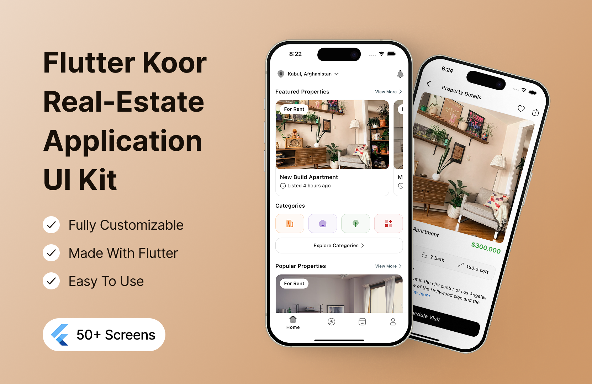
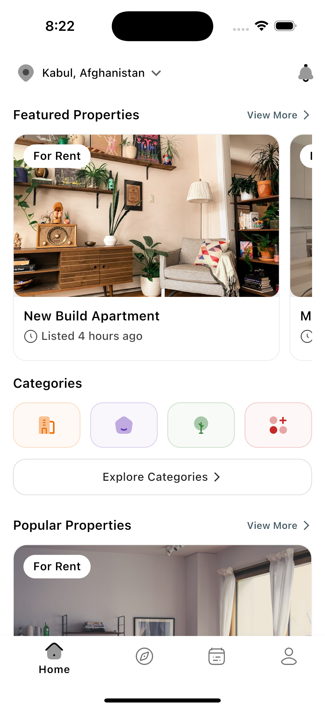
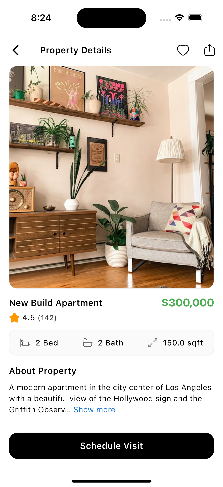
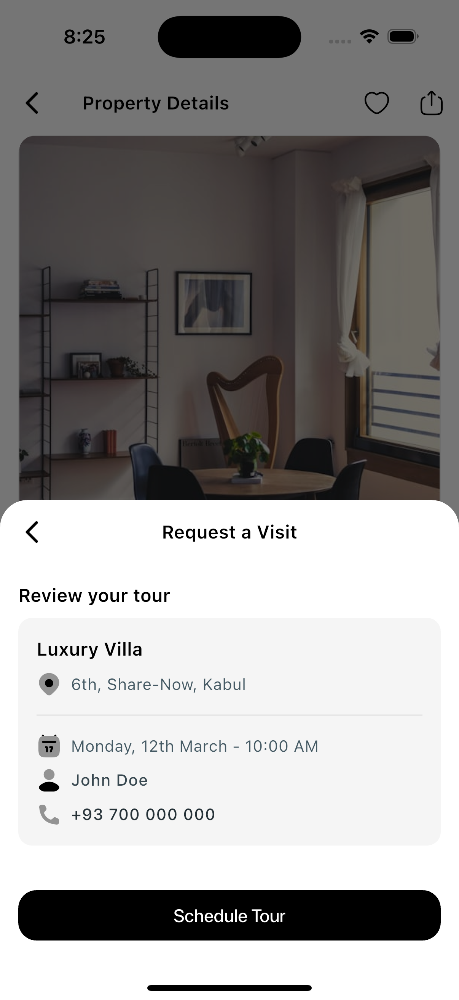
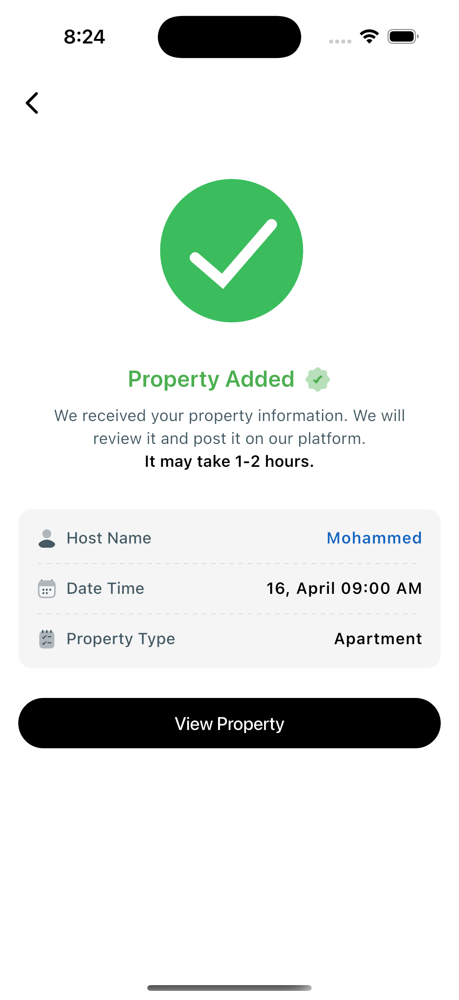
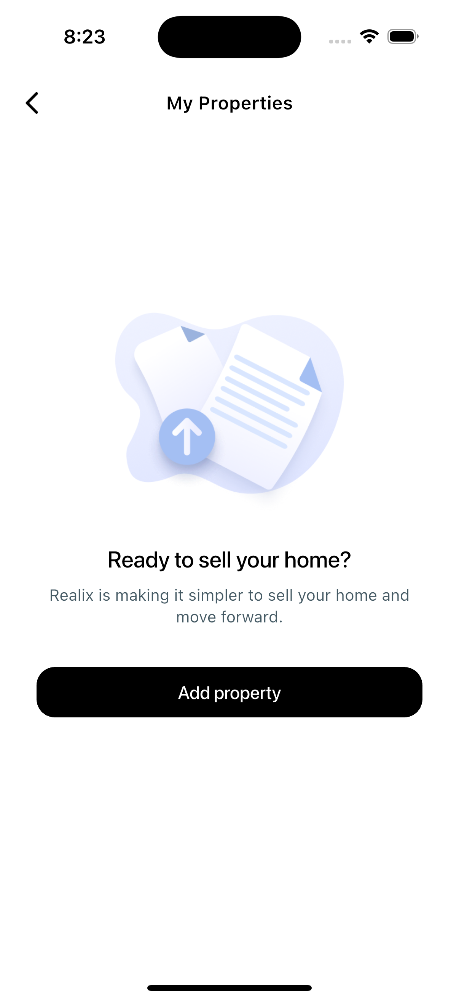

# Flutter Real-Estate Application UI Kit - Koor

> **🛒 How to Purchase**
>
> To get the full version of this UI kit with all features and screens, visit the [Koor UI Kit product page](https://afgprogrammer.com/flutter/koor-ui-kit) and follow the purchase instructions. After purchase, you'll receive access to the complete source code and future updates.

A complete Flutter UI kit for a real estate application, designed to help you build a beautiful and functional app quickly. This UI kit includes multiple screens, components, and features that are essential for a real estate application. This project is built using Flutter and Dart, and it utilizes the Mapbox Maps SDK for location services. The UI kit is designed to be easy to customize and extend, allowing you to create a unique app that meets your specific needs.

## Features
- Beautiful and modern UI design
- Multiple screens including home, property details, tour, and more
- Property listing with images, descriptions, and prices
- Map integration using Mapbox for location services
- User authentication screens
- Search functionality
- Tour booking and scheduling

## Getting Started
To purchase the full version of this UI kit, please visit [Koor UI Kit](https://afgprogrammer.com/flutter/koor-ui-kit).

1. Clone this repository.
2. Run `flutter pub get` to install dependencies.
3. Replace `YOUR_MAPBOX_ACCESS_TOKEN` in the code with your own Mapbox token.
4. Run `flutter run` to launch on your device or simulator.

## Screenshots

 | Page | Page
|---|---|
|  |  |
|  |  |
|  |

## Live Demo
[Live Demo](https://afgprogrammer.com/flutter/koor-ui-kit)

---